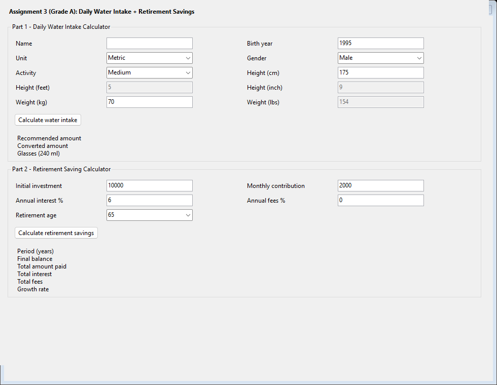
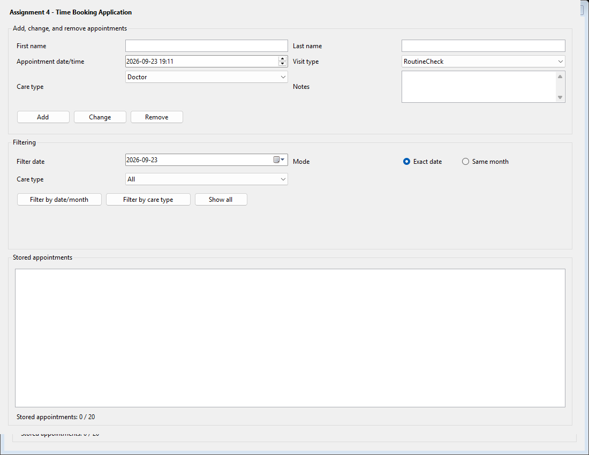
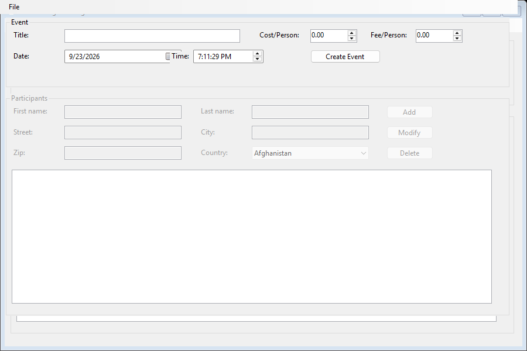

# Windows Forms Applications (.NET C#)

A suite of three practical desktop applications built using C# and Windows Forms (.NET 8). These projects focus on object-oriented programming, graphical user interface design, data validation, and event handling.

GitHub Repository: https://github.com/AF2310/windows-form-applications

---

## Applications in this Repository

### 1. Water Intake and Retirement Savings Calculator (Assignment 3)
A dual-purpose calculator application:
- Daily Water Intake: Estimates recommended daily water intake based on user weight and activity levels, supporting both Metric and Imperial units.
- Retirement Savings Projection: Calculates estimated retirement wealth based on initial balance, monthly deposits, expected annual interest rate, and number of years until retirement.

---

### 2. Time Booking Application (Assignment 4)
An appointment scheduling application:
- Add, update, delete, and view booked appointments.
- Manage dates, time slots, and appointment details.
- Filter appointments by time and completion status.
- Validates all input fields to prevent invalid entries.

---

### 3. EventManager and Participant Tracking (Assignment 5)
A conference and event administration system:
- Manage event details, address information, and ticket prices per participant.
- Track registered attendees in a synchronized list.
- Add, edit, and remove participants with full address details.
- Live calculation of total participants, total fee revenue, and financial summaries.

---

## Key Skills and Concepts

- Object-Oriented Programming (OOP) in C#
- Model-View separation: Isolating business calculation logic from the graphical user interface
- Input validation and exception handling with user-friendly error messages
- Dynamic Windows Forms controls (ComboBox, ListBox, DateTimePicker, GroupBox, MaskedTextBox)
- Structured enums for countries, units, and application states

---

## How to Build and Run

Requirements:
- Windows 10 / 11
- .NET 8.0 SDK or Visual Studio 2022+ with desktop development workload

To run any application using the .NET CLI:
1. Open a terminal in the assignment folder (for example, csharp-assignment3/Assignment3).
2. Run the application:
   dotnet run
